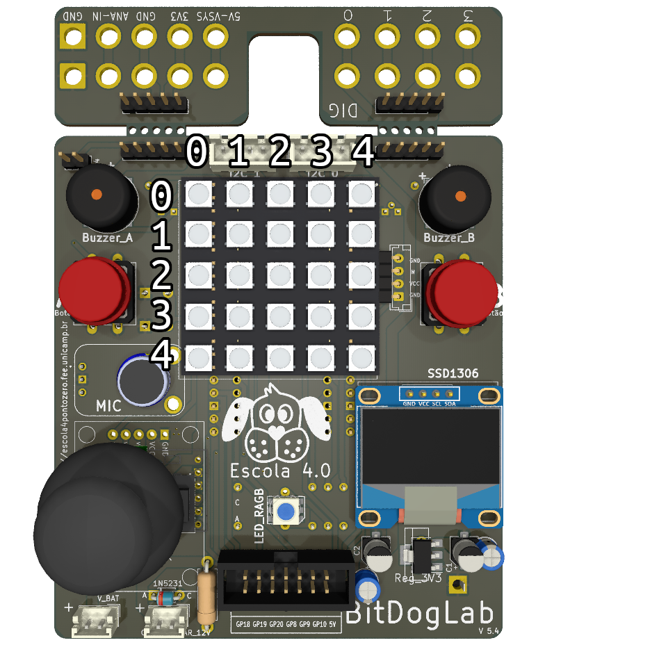

## ligar_led(x, y, cor)
Essa função liga um led na matriz de leds.
Parâmetros:
- x: qual a coluna do led que você quer ligar pode ser de 0 até 4
- y: qual a linha do led que você quer ligar pode ser de 0 até 4
- cor: [R,G,B] uma lista com os valores de vermelho, verde e azul.
    - cada cor pode ser de 0 até 255.

observação: o ponto (0,0) é no canto superior esquerdo.

## apagar_led(x, y)
Essa função apaga um led na matriz de leds.
Parâmetros:
- x: qual a coluna do led que você quer ligar pode ser de 0 até 4
- y: qual a linha do led que você quer ligar pode ser de 0 até 4
## apagar_leds()
Essa função apaga todos os leds da matriz de leds.
## limpar_tela()
Essa função apaga tudo da tela oled
## escrever_tela(text, x, y)
Essa função adiciona textos que vão aparecer na tela quando usar a função mostrar_tela
- texto: o texto que você quer que apareça
- x: a coluna onde o texto começa
- y: a linha onde o texto começa

observação: o ponto 0,0 é no canto superior esquerdo da tela
## mostrar_tela()
Essa função exibe os textos adicionado na tela
## botao_A_pressionado()
Essa função retorna `True` (verdade) uma vez quando o botão for pressionado, e `False` (falso) nos outros casos.
## botao_B_pressionado()
Essa função retorna `True` (verdade) uma vez quando o botão for pressionado, e `False` (falso) nos outros casos.
## valor_botao_A()
Essa função retorna se `True` (verdade) o botão está pressionado e `False` (falso) caso contrário caso contrário.
## valor_botao_B()
Essa função retorna se `True` (verdade) o botão está pressionado e `False` (falso) caso contrário caso contrário.
## botao_A_solto()
Essa função retorna `True` (verdade) no momento que você soltar o botão, e `False` (falso) nos outros casos.
## botao_B_solto()
Essa função retorna `True` (verdade) no momento que você soltar o botão, e `False` (falso) nos outros casos.
## som_morreu()
Essa função toca o som de quando o jogador morre.
## numero_aleatorio(numero1, numero2)
Essa função retorna um número aleatório maior ou igual ao `numero1` e menor ou igual ao `numero2`.
## loop(func)
Essa função recebe uma função com o que executar em cada loop do jogo.
Parâmetros:
- func: uma função que recebe o valor de micro segundos que passou desde a última vez que a função foi executada.
## ler_arquivo(nome)
Essa função lê um arquivo, se o arquivo não existe ela retorna uma string vazia ''. Caso contrário retorna o que estava escrito no arquivo.
- nome: nome do arquivo
## escrever_arquivo(nome, mensagem)
Essa função salva um texto em um arquivo.
- nome: nome do arquivo
- mensagem: texto a ser salvo
