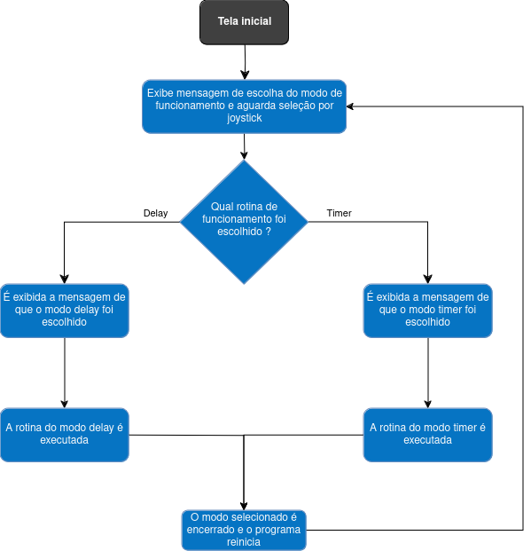
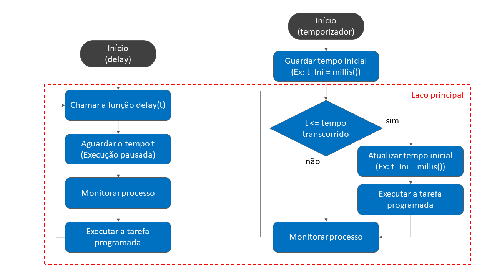

# Temporização com e sem delay para aplicações específicas

Esse repositório contém o Projeto 1 do Grupo 5 da matéria de IE323 - Tópicos em Eletrônica.

O trabalho, como projeto educacional, busca apresentar para estudantes algumas diferenças entre o uso de _delays_ e _timers_. O projeto é uma sugestão de atividade didática, contendo exposição teórica em slides e também um exemplo prático utilizando a placa [BitDogLab](https://github.com/BitDogLab/BitDogLab/tree/main).

Os alunos irão interagir com a placa através de um software, que permite a comparação entre ambos os métodos de temporização. Para isso, é realizada a contagem de vezes em que foi detectado que o **Botão A** ou o **Botão B** da placa foram pressionados durante duas rotinas distintas, uma utilizando uma abordagem mista entre _delay_ e _timer_, e outra rotina utilizando apenas _timer_.

### Autores

Carlos Julián Muñoz Quiroga, RA: 204200  
Patric Moreto, RA: 223083

## Recursos de hardware utilizados da BitDogLab

- Botões A e B
- Matriz de LEDs 5 x 5
- Joystick
- Display oLED

## Fluxogramas

### Tela inicial

### Modos de operação

## Instruções de uso da BitDogLab

- **Tela inicial:** O programa irá iniciar com uma mensagem no display oLED pedindo para o usuário selecionar um modo de operação. A escolha é feita através do joystick: caso o direcional seja movido para a esquerda, é iniciada a rotina de delay, caso seja movido para a direita, irá iniciar a rotina de timer. Para ambos os casos, a ideia do programa é contar quantas vezes os botões foram pressionados e exibir essa informação no display oLED.    
Será possível ver as diferenças entre ambos os modos devido ao modo que as contagens serão realizadas. Maiores explicações são fornecidas abaixo.

- **Modo delay:** Consiste em demonstrar como a interrupção do fluxo do programa ocasionada por delays pode impedir o processamento de tarefas em paralelo, mas ainda é utilizável caso apenas uma tarefa esteja sendo executada. Isso é demonstrado através de duas funcionalidades distintas sendo executadas em paralelo: a matriz de LEDs construindo uma seta e a contagem de vezes que o botão foi pressionado.    
A rotina sendo executada irá alternar entre o uso de delay e timer, ambos com intervalos de 3 segundos. Enquanto o delay é executado, uma figura do Snoopy dormindo aparece no display, indicando que a BitDogLab não está detectando quando os botões são pressionados. Quando alterna para o timer, a figura se torna o Snoopy acordando, indicando que agora a placa é capaz de perceber quando os botões forem pressionados. Em paralelo, a matriz de LEDs irá construir uma seta a cada intervalo de 3 segundos, mostrando que processos temporizados mais simples independem da estratégia utilizada.

- **Modo timer:** Utiliza apenas timers durante todo seu processo, de modo que a figura exibida no display é do Snoopy atento, indicando que a BitDogLab está detectando todas as vezes que os botões foram pressionados. Em paralelo, é configurado um timer de 3 segundos para construir uma seta na matriz de LEDs.
