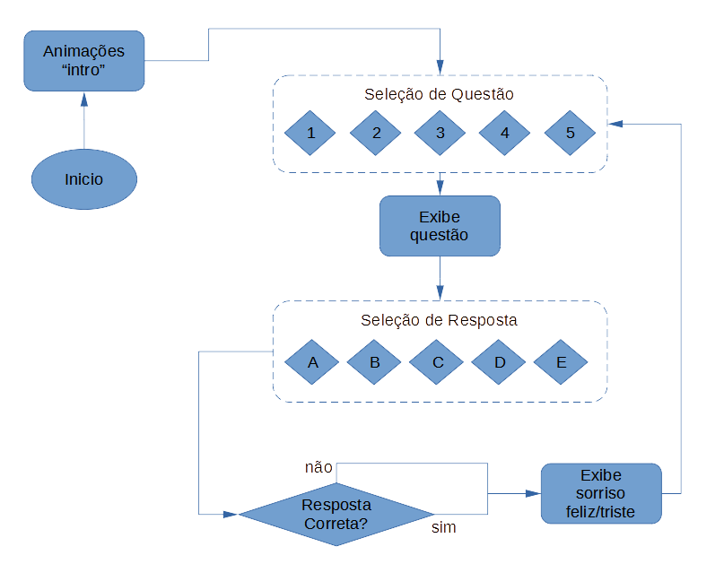

# Autores

Vinicius Emanoel Ares, RA: 083028  
Edson Costa Oliveira, RA: 188405 

# BitDogLab_Math

BitDogLab_Math é um jogo de perguntas e respostas sobre matemática para a placa [BitDogLab](https://github.com/BitDogLab/BitDogLab). O jogo foi desenvolvido como projeto 1 da disciplina da FEEC/Unicamp IE323 - Sistemas Embarcados para ensino com abordagem STEM

  
Clique para saber mais sobre a disciplina.

  Sistemas Embarcados para ensino com abordagem STEM é uma disciplina da pós-graduação da FEEC-UNICAMP ofertada pelo professor Fabiano Fruett. O objetivo da matéria é desenvolver projetos que envolva IoT, eletrônica e IA com o intuito de levar ferramentas para os alunos do ensino fundamental e médio utilizando a abordagem STEM (Science, Technology, Engineering and Mathematics). [BitDogLab](https://cpg.fee.unicamp.br/lista/caderno_horario_show.php?id=1932).

O objetivo do projeto 1 da disciplina é familiarizar-se com a placa e ganhar autonomia para desenvolver o primeiro programa.  

Esta primeira versão do BitDogLab_Math contém 5 perguntas com 5 alternativas cada. Primeiramente são exibidas animações quando o software iniciado. Em seguida seleciona-se a questão pode meio do joystick analógico com movimentos esquerda/direita, a questão é exibida no display Oled. Pressiona-se a tecla A para confirmar a escolha e então o gráfico da questão é exibido na matriz de LEDs por um tempo. Quando a contagem regressina no display Oled acaba, passa-se à seleção de alterativas para resposta. Então, com movimentos esquerda/direita no joystick a matriz de LEDs exibe as letras A até E correspondentes às alternativas, e simultaneamente o display Oled exibe o texto da resposta. O usuário confirma a seleção pressionando o botão A. Finalmente são exibidas na matrix de LEDs imagens :) ou :( dependendo se a resposta foi correta ou errada. Após isso o programa volta para a seleção de perguntas e o processo se repete indefinidamente. Para encerrar, deve-se pressionar 2 vezes o botão próximo à bateria na parte traseira da BitDogLab.  
O fluxograma abaixo ilustra o funcionamento do programa:

Para mais informações, é possível acessar o relatório do projeto disponibilizado no [link](https://docs.google.com/document/d/1t0RudSiQLCfQGe18FgQLw0GA5CTjqmQ4/edit?usp=sharing&ouid=113991507111012118869&rtpof=true&sd=true). 

## Como instalar?

1. Instale a IDE Thonny a partir de [https://thonny.org/](https://thonny.org/).
2. Conecte a placa BitDogLab ao computador através de um cabo micro-USB.
3. Siga as instruções em [Introdução prática a BitDogLab](https://escola-4-ponto-zero.notion.site/Cap-tulo-02-Usando-o-IDE-Thonny-para-desenvolvimento-d5dce52947244cd6a64da4ba77831c7a) para certificar-se que a BitDogLab está sendo reconhecida no Thonny.
4. Baixe os códigos `main.py` e pergunta_resposta.py neste repositório.
5. No Thonny, acesse `Arquivo > Abrir` e localize os arquivos `main.py` e pergunta_resposta.py(por exemplo, na pasta Downloads).
6. Pressione o botão "play" (triângulo verde) para executar o programa na BitDogLab temporariamente.
7. Se a execução estiver correta e você quiser salvar o código na BitDogLab para executá-lo posteriormente, então:
8. se você desejar preservar o programa atual de sua BitDogLab, antes de prosseguir, salve o arquivo main.py existente em uma pasta de seu computador.
9. Agora, com a guia que contém `projeto01.py` ativa no Thonny vá em `Arquivo > Salvar como`.
10. Quando a caixa de seleção aparecer com "Raspberry Pi e Computador", selecione Raspberry Pi, clique sobre `main.py` para sobrescrever.
11. Pronto, você pode desconectar a BitDogLab e o programa pode ser executado (ou reiniciado) apertando o botão próximo à bateria.
