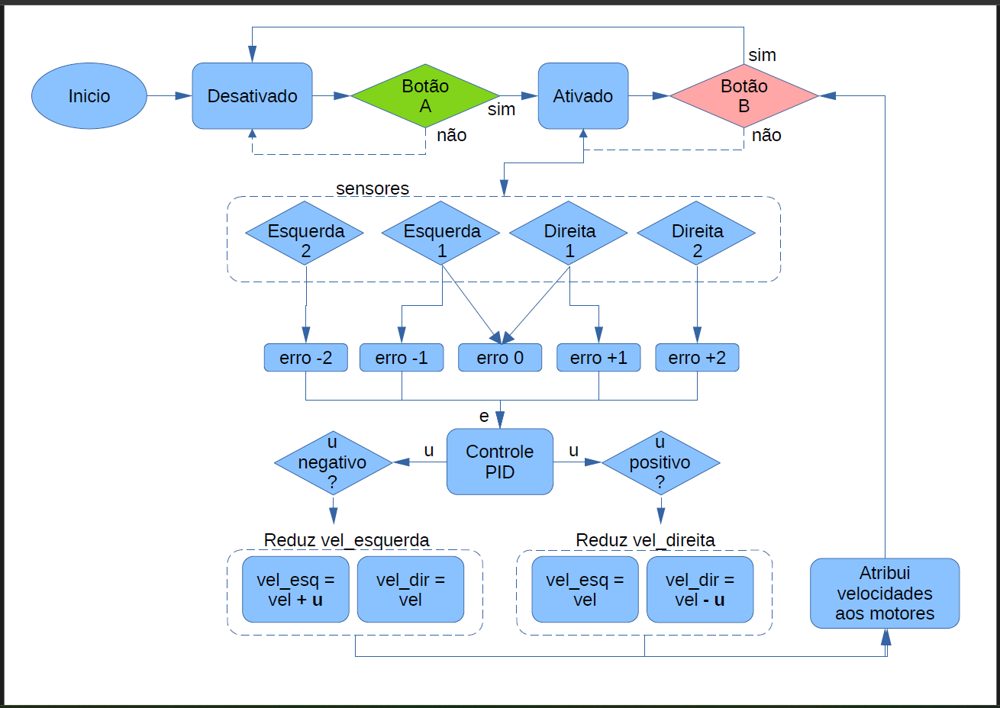

# Autores

Vinicius Emanoel Ares, RA: 083028  
Edson Costa Oliveira, RA: 188405 

# BitMóvel Seguidor de Linha

BitMóvel Seguidor de Linha é um projeto educacional de robô seguidor de linha para a placa [BitDogLab](https://github.com/BitDogLab/BitDogLab). O projeto foi desenvolvido como projeto 2 da disciplina da FEEC/Unicamp IE323 - Sistemas Embarcados para ensino com abordagem STEM

  
Clique para saber mais sobre a disciplina.

  Sistemas Embarcados para ensino com abordagem STEM é uma disciplina da pós-graduação da FEEC-UNICAMP ofertada pelo professor Fabiano Fruett com auxílio do professor Daniel Vieira. O objetivo da matéria é desenvolver projetos que envolva IoT, eletrônica e IA com o intuito de levar ferramentas para os alunos do ensino fundamental e médio utilizando a abordagem STEM (Science, Technology, Engineering and Mathematics). [BitDogLab](https://cpg.fee.unicamp.br/lista/caderno_horario_show.php?id=1932).

O objetivo do projeto 2 da disciplina é usar a placa BitDogLab conectada a dispositívos externos.  

O BitMóvel Seguidor de Linha é um robô diferencial com 2 rodas motrizes e uma esfera de apoio na frente, formando um tripé ou triciclo. O robô usa sensores reflexivos infravermelhos TCRT5000 para detectar uma linha escura no chão. O chassis e suporte dos sensores é fabricado por impressão 3D em PLA. Além da função seguidor de linha, os botões A e B são programados para comandar o robô para ativo ou desativado, respectivamente. O robô inicia no modo desativado, então quando o botão A é pressionado o robô está em modo de movimento ativo para frente seguindo a linha embaixo do chassis. Quando o botão B é pressionado o robô fica parado até que se pressione o botão A novamente.
Este projeto usa:
- 1 Placa BitDogLab
- 2 motores DC 3-6V com Caixa de Redução e Eixo Duplo + Roda 68mm
- 1 Driver ponte H modelo HW-166
- 4 sensores TCRT5000
- 1 Chassis impresso conforme arquivo (filename.stl)
- 1 Suporte de sensores conforme arquivo (filename.stl)
  
O fluxograma abaixo ilustra o funcionamento do programa:

Para mais informações, é possível acessar o relatório do projeto disponibilizado no [link](https://docs.google.com/document/d/1t0RudSiQLCfQGe18FgQLw0GA5CTjqmQ4/edit?usp=sharing&ouid=113991507111012118869&rtpof=true&sd=true). 

## Como instalar?

1. Instale a IDE Thonny a partir de [https://thonny.org/](https://thonny.org/).
2. Conecte a placa BitDogLab ao computador através de um cabo micro-USB.
3. Siga as instruções em [Introdução prática a BitDogLab](https://escola-4-ponto-zero.notion.site/Cap-tulo-02-Usando-o-IDE-Thonny-para-desenvolvimento-d5dce52947244cd6a64da4ba77831c7a) para certificar-se que a BitDogLab está sendo reconhecida no Thonny.
4. Baixe os códigos `main.py` e `pergunta_resposta.py` neste repositório.
5. No Thonny, acesse `Arquivo > Abrir` e localize os arquivos `main.py` e `pergunta_resposta.py` (por exemplo, na pasta Downloads).
6. Pressione o botão "play" (triângulo verde) para executar o programa na BitDogLab temporariamente.
7. Se a execução estiver correta e você quiser salvar o código na BitDogLab para executá-lo posteriormente, então:
   - se você desejar preservar o programa atual de sua BitDogLab, antes de prosseguir, salve o arquivo main.py existente em uma pasta de seu computador;
   - agora, com a guia que contém `main.py` ativa no Thonny vá em `Arquivo > Salvar como`;
   - quando a caixa de seleção aparecer com "Raspberry Pi e Computador", selecione Raspberry Pi, clique sobre `main.py` para sobrescrever.
8. Pronto, você pode desconectar a BitDogLab e o programa pode ser executado (ou reiniciado) apertando o botão próximo à bateria.