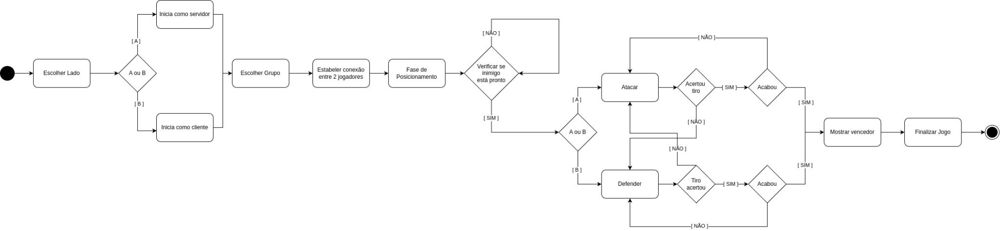

# Batalha Naval BitDogLab

O projeto consiste de um material de ensino para desenvolvimento de jogos usando a BitDogLab, Wi-Fi e a interface BitDogLib. Esse material consiste da própia placa BitDogLab, uma biblioteca MicroPython para abstrair conceitos complexos de desenvolvimento (BitDogLib) e um tutorial, o qual ensina o básico da construção da placa, como programar e uma atividade, na qual ensina programar um jogo. O objetivo desse projeto é que ao final do material de ensino o aluno aprimore sua lógica de programação, além de despertar o interesse na área da computação.

O tutorial não foi desenvolvido ainda.

## Autores:
Leonardo Boss, 177755
Eduardo Vidoretti Argenton, 290888

## Itens BNCC:
- EF07CO01:
Criar soluções de problemas para os quais seja adequado o uso de registros e matrizes unidimensionais para descrever suas informações e automatizá-las usando uma linguagem de programação.
- EF69CO02:
Elaborar algoritmos que envolvam instruções sequenciais, de repetição e de seleção usando uma linguagem de programação.
- EF69CO04:
Construir soluções de problemas usando a técnica de decomposição e automatizar tais soluções usando uma linguagem de programação. 
- EF08CO02:
Criar soluções de problemas para os quais seja adequado o uso de listas para descrever suas informações e automatizá-las usando uma linguagem de programação, empregando ou não a recursão como uma técnica para resolver o problema.

