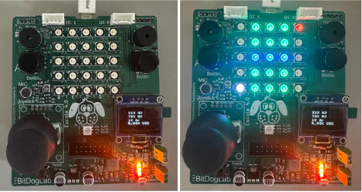
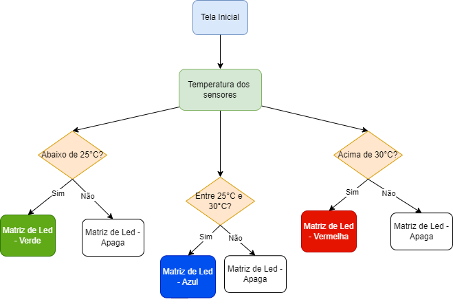
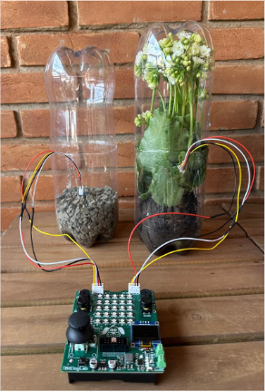
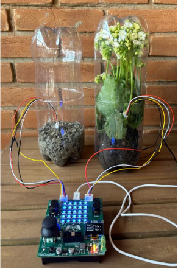
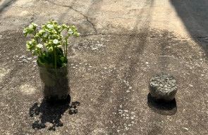
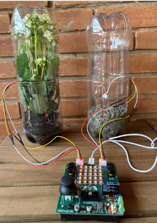

# Projeto 2 - Efeito Estufa e Aquecimento Global - IE323A

## Autor

Victor Anthony Teixeira dos Santos - 206467

## Introdução
Este projeto, se trata de um experimento em que podemos demonstrar o efeito estufa e o aquecimento global, de forma que possamos elucidar esse problema de uma maneira clara para os alunos.

## Objetivos
A ideia é que os professores possam usar a BitDogLab para complementar o que foi passado em aula, de forma que possa facilitar a melhor visualização do aluno sobre o conteúdo a ser estudado.

   Este projeto está alinhado com as seguintes habilidades específicas da BNCC:

**(EF07CI12)** Demonstrar que o ar é uma mistura de gases, identificando sua composição, e discutir fenômenos naturais ou antrópicos que podem alterar essa composição.

**(EF07CI13)** Descrever o mecanismo natural do efeito estufa, seu papel fundamental para o desenvolvimento da vida na Terra, discutir as ações humanas responsáveis pelo seu aumento artificial (queima dos combustíveis fósseis, desmatamento, queimadas etc.) e selecionar e implementar propostas para a reversão ou controle desse quadro.

## Materiais Utilizados:

**Recursos on-board**
- Display Oled
- Botão
- Matriz RGB

	**Recursos off-board**
- 2 x Sensores de Umidade e Temperatura AHT10
- 4 x Cabos groove 20cm
- 2 x Conectores para cabo groove

## Códigos

Os códigos estão divididos em duas partes, sendo a parte 1, relacionado a composição do ar/fenômenos. E parte 2, relacionado ao experimento sobre o efeito estufa e aquecimento global. Para o experimento foram utilizados sensores AHT10 (temperatura e umidade).

A parte 1, basicamente, conforme a pessoa aperta o botão vai aparecendo informações e vão guiando ela pelo conteúdo.

Já o código 2, é o código dos sensores para o experimento. Segue abaixo, o fluxograma do Código 2

De acordo com a temperatura dos sensores, a matriz de led muda de cor.

Para mais detalhes sobre o funcionamento do arquivos e como utilizá-lo, consulte os próprios códigos fonte que possuem comentários e estão disponíveis neste repositório.

## Experimento

O experimento tem como objetivo principal fazer uma comparação entre temperaturas em dois ambientes diferentes.

Basicamente, o experimento vai precisar de 4 garrafas pet 's, terra, planta e brita, além de dois sensores AHT10.

1 - Montar o experimento

2 - Fazer um medida antes de levar o ambiente para o sol 

3 - Levar os ambientes para o sol (Recomendação: 30 minutos)

4 - Realizar outra medição após tirar o ambiente do sol

## Uso da BitDogLab

A BitDogLab possui um repositório próprio que pode ser encontrado no link:https://github.com/BitDogLab/BitDogLab/tree/main

Para uma primeira experiência com a BitDogLab

1. Energizar a placa da BitDog - Plugue o cabo USB no computador ou utilize uma bateria adequada.
2. Aguarde enquanto a BitDog realiza o seu proceso de inicialização automático.
3. Abrir a IDE Thonny e carregar os códigos que estão no repositório
 
**Observações importantes**

Caso for replicar o experimento, não esquecer de:
- Carregar a biblioteca AHT10 no microcontrolador.
- Ficar atento quando for utilizar os pinos da comunicação I2C.
- Ficar atento ao ligar os pinos do I2C com os pinos do sensor AHT10.
- Ficar atento para conectar corretamente os sensores, lembrando que o I2C1 fica na esquerda da BitDogLab e o I20 fica na direita.

Para mais informações consultar o documento no docs, lá tem uma explicação detalhada do código e do experimento.
