# Resumo

O projeto consiste em uma aplicação desktop para facilitar o processo de baixar e instalar softwares no BitDogLab para leigos. O usuário poderá encontrar todos os projetos na loja e poderá com um clique baixar e instalar o software na BitDogLab sem precisar compilar, programar ou usar outros programas como o thonny IDE, ampy, Arduino IDE, etc…

# Repositórios

	O projeto foi organizado em repositórios, isso quer dizer que é possível adicionar vários repositórios distintos. Cada repositório pode ter vários programas. Na imagem abaixo está destacado os 2 botões da página inicial que lidam com repositórios:  
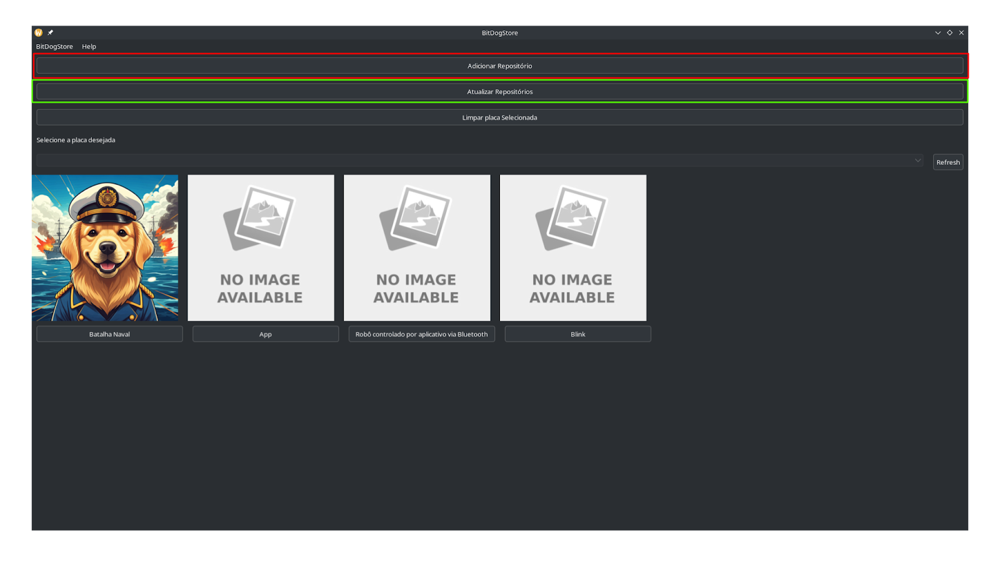

## Adicionar Repositórios

Ao clicar no botão “Adicionar Repositório” (vermelho) o usuário será direcionado para a seguinte página, a qual os botões estão destacados:  
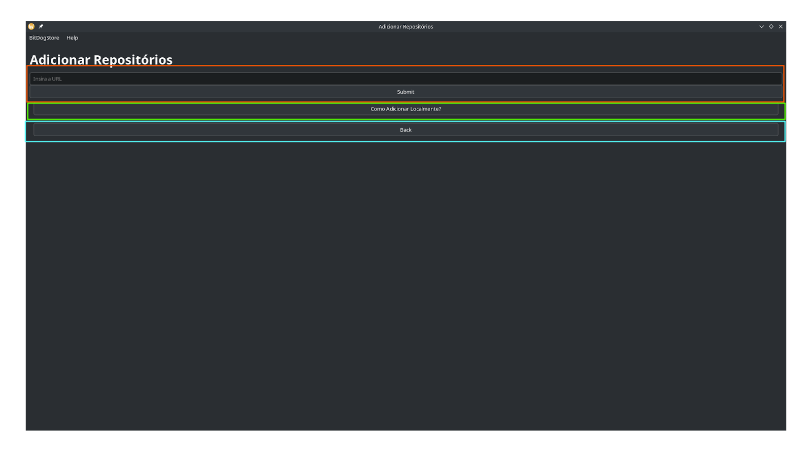  
O campo Insira a URL e o botão “Submit” (laranja) trabalham em conjunto para adicionar um repositório Git, ao adicionar uma URL, e clicar em “Submit” será baixado um repositório, caso o link seja válido, senão apresentará um erro.  
Já o botão “Como adicionar Localmente?” (verde) apresentará o seguinte pop-up para o usuário instruindo-o como adicionar um repositório localmente:  
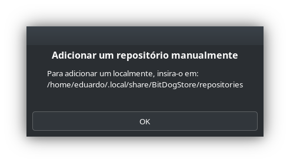  
Por fim o botão “Back” (azul) volta para  a página inicial

## Atualizar Repositórios

Ao clicar no botão “Adicionar Repositório” (verde) os repositórios, que são válidos, serão atualizados através de um “git pull”, logo apenas repositórios git podem ser atualizados. A seguir um exemplo do pop-up:  
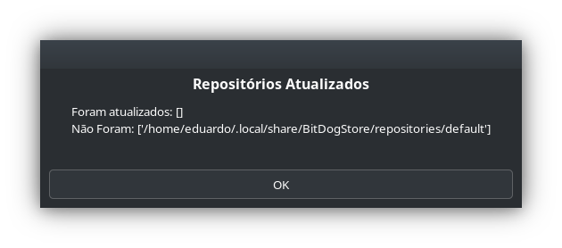

# Arquivos de configuração

	Um repositório só será utilizado se seguir o padrão dos arquivos de configuração.

### repo.json

	Logo na raiz do repositório é necessário um arquivo repo.json. A seguir um exemplo:

```json
{
  "repository_name": "Projetos_Disciplina_IE323",
  "description": "Projetos Desenvolvido na disciplina IE323",
  "repository_maintainer_name": [
    "Daniel Silveira"
  ],
  "repository_maintainer_contact": [
    "https://github.com/danielvieira95"
  ],
  "website": [
    "www.site.com"
  ],
  "apps_folder": [
    "Projeto2",
    "teste"
  ],
  "repo_micropython_firmware": "BitDogLab_W.uf2"
}
```

A função de cada item é:

* **repository\_name**: O nome do repositório (Obrigatório);  
* **description**: Uma breve descrição do repositório;  
* **repository\_maintainer\_name**: O nome dos mantenedores;  
* **repository\_maintainer\_contact**: Contatos dos mantenedores;  
* **website**: Sites do repositório;  
* **apps\_folder**: As pastas as quais estão os programas. Essas pastas tem que estar na raiz, e logo dentro dela deve haver os apps (Obrigatório);  
* **repo\_micropython\_firmware**: O caminho de um firmware para micropython customizado

Devido a questão de tempo utilizamos apenas o **repo\_micropython\_firmware** e o **apps\_folder**. Os demais estão sem utilidade.

## app.json

	Cada app tem que ter em sua raiz um arquivo app.json. E somente será reconhecido como um app se o tiver. A seguir dois exemplos de app.json, um com micropython e outro com C 

```json
{
  "app_name": "Batalha Naval",
  "description": "Jogo Multiplayer de Batalha naval",
  "maintainers": [
    "Eduardo Vidoretti Argenton",
    "Leonardo Boss"
  ],
  "contacts": [
    "e290888@dac.unicamp.br",
    "l77755@dac.unicamp.br"
  ],
  "docs": "README.md",
  "icon": "batalhaNaval.png",
  "micropython_config": {
    "firmware": "custom.uf2",
    "files": [
      "BitDogLib/__init__.py",
      "BitDogLib/buttons.py",
      "BitDogLib/buzzer.py",
      "BitDogLib/joystick.py",
      "BitDogLib/led.py",
      "BitDogLib/oled.py",
      "BitDogLib/utils.py",
      "BitDogLib/wifiP2P.py",
      "explosion.pbm",
      "main.py",
      "watersplash.pbm"
    ]
  }
}
```

```json
{
  "app_name": "App",
  "description": "Desc",
  "maintainers": [
    "Vinicius Emanoel Ares",
    "Edson Costa Oliveira"
  ],
  "docs": "README.md",
  "c_config": {
    "firmware": "app.uf2"
  }
}
```

A função de cada item é:

* **app\_name**: O nome do app (Obrigatório);  
* **description**: Uma breve descrição do projeto;  
* **maintainers**: Os mantenedores do app;  
* **contacts**: Contato dos mantenedores;  
* **docs:** Caminho para o arquivo README;  
* **icon**: Ícone do app;  
* **micropython\_config**: Bloco de configuração de um app micropython (Obrigatório);  
  * **firmware**: Caminho para um firmware de micropython  que deve ser usado com o app;  
  * **files**: Caminho para os arquivos que deverão ser inseridos na BitDog durante a instalação do app (Obrigatório);  
* **c\_config**: Bloco de configuração de um app C (Obrigatório);  
  * **firmware**: Caminho para o UF2 do app

# Limpar placa

	Na imagem abaixo está em destaque o botão “Limpar placa Selecionada” (vermelho), ao clicá-lo apagará todo o conteúdo da placa e colocará o firmware default de micropython
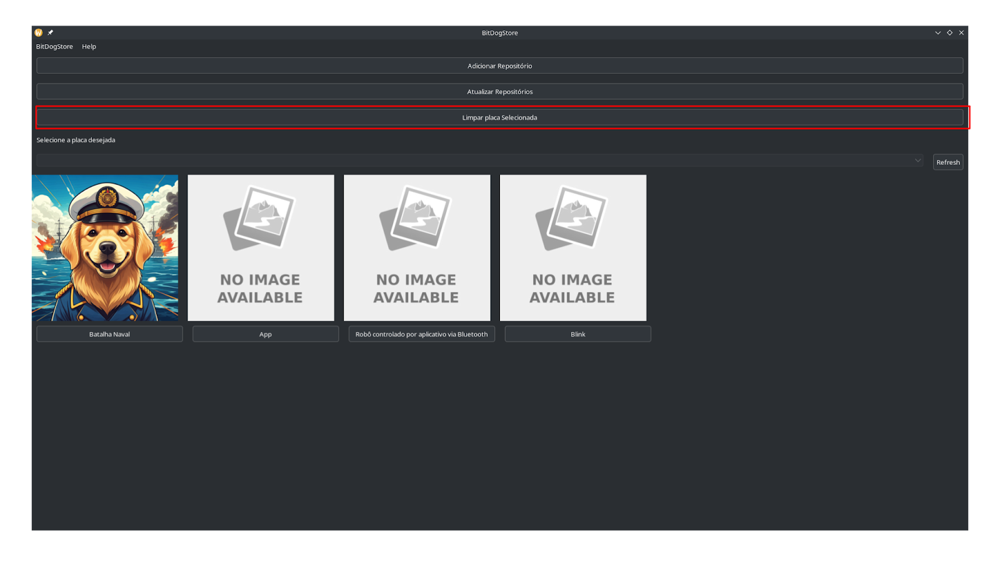

# 

# Página do App

Abaixo a página de um app:  
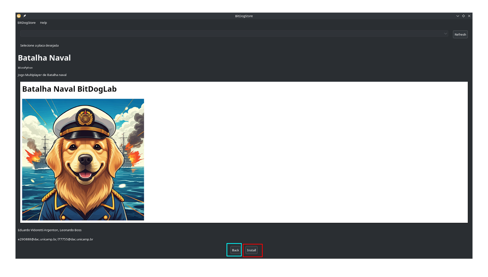  
A página do app mostra informações do app. Nela o arquivo README é colocado em uma *box* individual(em branco), a qual é independente do resto da página. Além disso há os botões “Back” (azul) e “Install” (vermelho). O primeiro volta a página inicial, o segundo começa o processo de instalação.

# Instalação

	O processo de instalação pode ser representado pelo diagrama abaixo:  
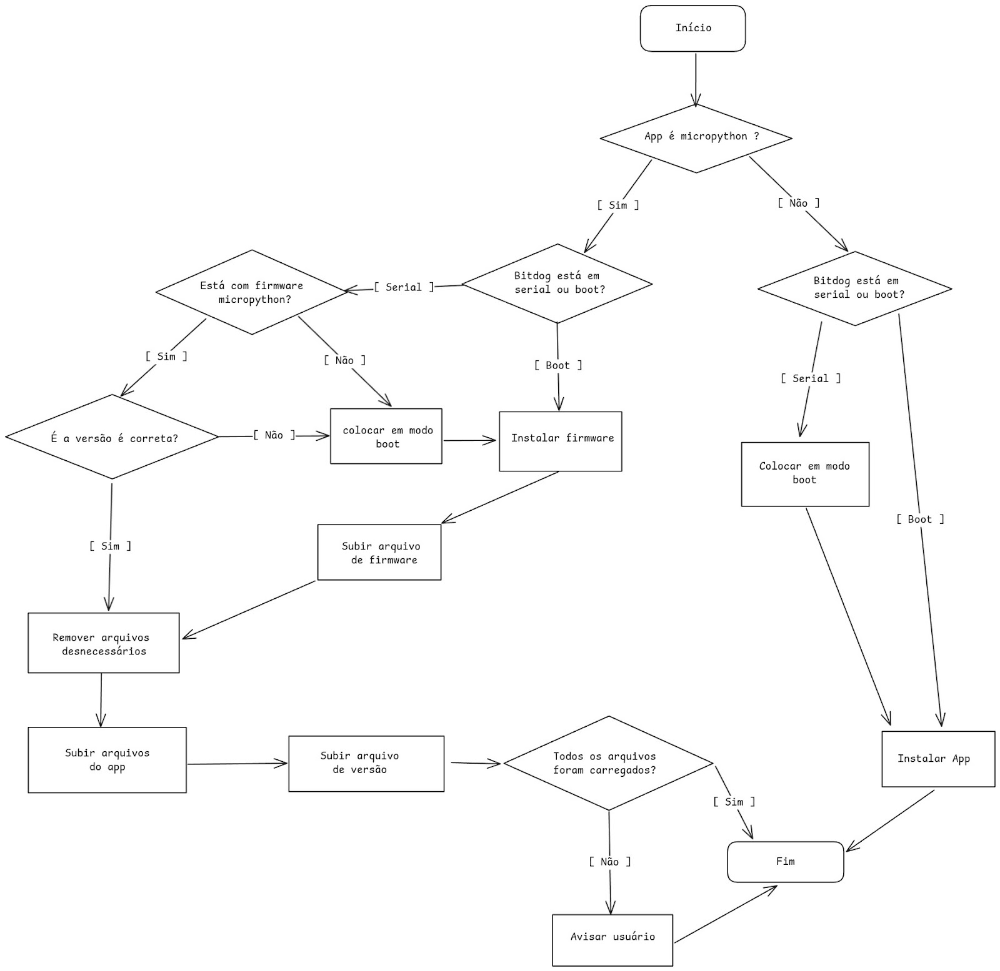

A seguir será apresentado as imagens do passo a passo da instalação de um app micropython, com a placa estando com um programa em C e inserida no modo serial. Assim poderá ser mostrado o máximo de telas.  
Primeiramente, deve-se inserir a placa no computador e apertar o botão “Refresh” (vermelho), caso tenha mais de uma placa, selecioná-la no dropdown (azul). Então clicar em “Install” (verde)  
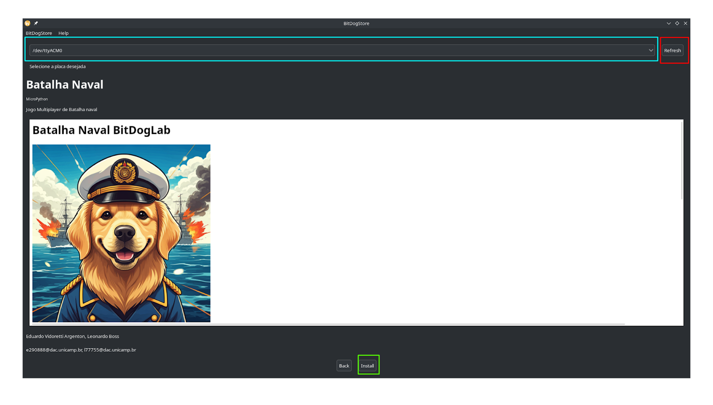  
Será verificado se a placa está em micropython, como o app. Uma vez que não está será necessário trocar o firmware, para isso aparecerá a seguinte tela indicando que se deve inserir novamente a placa em modo bootloader então apertar “Refresh”, selecionar a placa no dropdown (vermelho), que apenas mostrará placas em modo bootloader as quais estão montadas e clicar em “Ok” (verde). Enquanto não for selecionada uma placa o botão “Ok” (verde) não terá funcionamento. Após pressionar “Ok” pode levar alguns segundos para continuar.  
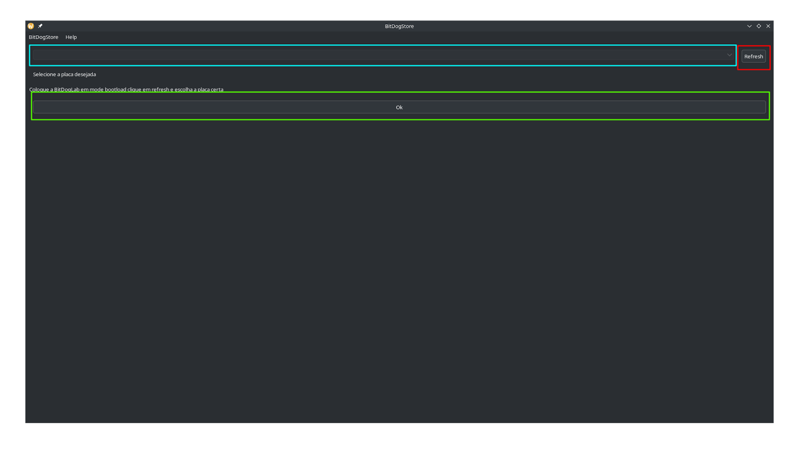  
Após isso, será solicitado escolher uma placa em modo Serial para enfim instalar o app.Ela segue a mesma lógica da tela anterior  
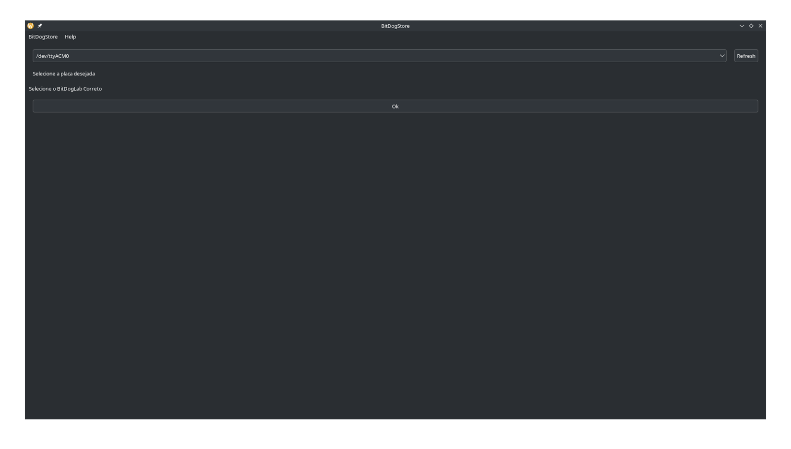  
Ao pressionar Ok enfim começará a instalação, mais uma vez pode demorar um tempo para continuar. Primeiramente será colocado o arquivo firmware dentro da placa. Esse arquivo consiste de um hash do arquivo de firmware com o qual está carregado. Após isso será apagado arquivos presentes na placa o qual não são mais necessários. Em seguida será transferido para a placa os arquivos indicados no app.json. Então será criado o version.json dentro da placa. Esse arquivo consiste de todos os arquivos que deveriam ter sido transferidos para a placa  e suas hashes. Por fim, será checado se todos os arquivos do version.json estão realmente presente na placa. Então aparecerá um pop-up para o usuário indicando o sucesso ou falha da instalação. Abaixo a imagem de sucesso:  
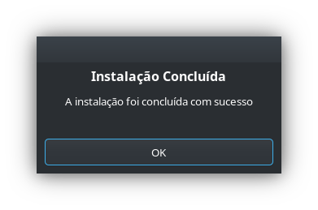
