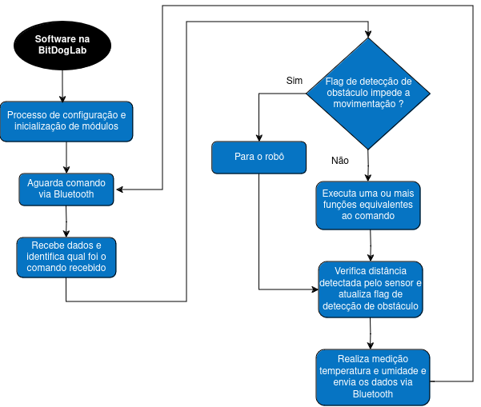

# Robô explorador

Esse repositório contém o Projeto 3 do Grupo 5 da matéria de IE323 - Tópicos em Eletrônica, da Faculdade de Engenharia Elétrica e de Computação da Universidade Estadual de Campinas.

O trabalho, como projeto educacional, busca apresentar para estudantes uma ideia para criação de robôs através da união de conceitos como comunicação sem fio, utilizando Bluetooth e Wi-Fi, sinais modulados por largura de pulso (PWM) para controle de motores, lógica para movimentação de robôs, uso de sensores para exploração e percepção do ambiente, como câmera, sensor de temperatura e sensor ultrassônico, movimentação e criação de um aplicativo de celular. O projeto é um compilado de sugestões de atividades didáticas, contendo exposição teórica em slides e também exemplos práticos utilizando a placa [BitDogLab](https://github.com/BitDogLab/BitDogLab/tree/main) e periféricos listados a seguir.

Os alunos irão interagir com o robô através de um **aplicativo de celular** que controla a movimentação do agente robótico por meio do movimento do aparelho. Para isso, é utilizado o **acelerômetro**, um sensor interno que serve como fonte de dados da movimentação que está sendo realizada. Ao identificar a direção do deslocamento através da análise desses dados, é enviado um comando à BitDogLab via **Bluetooth**, que será interpretado e executado pela placa. Também utilizando o Bluetooth, é possível enviar **dados de temperatura e umidade** de um sensor conectado à BitDogLab para exibição no aplicativo. Ainda, o aplicativo apresenta, em tempo real, **imagens** que estão sendo enviadas por **wi-fi** para um servidor web por uma câmera disposta no agente robótico, sendo possível movimentar a câmera por meio de um **joystick** disposto no aplicativo de celular, que controla dois servo motores presentes no robô que servem como base para a câmera. Caso o robô esteja muito próximo de um obstáculo, um **sensor ultrassônico** irá detectar e impedir movimentos frontais, evitando a possível colisão.

### Autores

Carlos Julián Muñoz Quiroga, RA: 204200  
Patric Moreto, RA: 223083

## Recursos de hardware utilizados da BitDogLab

**On-board:**
- Buzzer
- Matriz de LEDs 5 x 5
- Periférico para comunicação UART/I2C (canais 0 e 1)

**Off-board:**
- Celular
- Módulo bluetooth HC-05
- Robô móvel ([chassi](https://www.tinkercad.com/things/1lvaPDfdjkt-chassi-bitmovel/edit?sharecode=c4YGIVprehL-UuPeUL_7wFy6jiYbiTO2cclIelt4kQc), [aerofólio](https://www.tinkercad.com/things/buQTXUUQPVn-aerofolio/edit?returnTo=%2Fthings%2FbuQTXUUQPVn-aerofolio) e [conexões + detalhes](https://docs.google.com/document/d/19eDUn6APOkDckY-d9zxlf_N0l-tGTjby_PLXqS_WKOg/edit?usp=sharing))
- 2 motores DC
- 2 rodas 68 mm
- Bateria LiPo 2S 550 mAh
- Driver para motor (ponte H TB6612FNG)
- ESP32-CAM + OV2640
- Módulo conversor USB / TTL
- Sensor ultrassônico HC-SR04
- Sensor de temperatura AHT10
- Placa de circuito impresso
- 2 servo motores + suporte plástico/impresso em 3D para movimentação pan e tilt
- Placa expansora com expansão I2C e regulador 5 V

Os componentes que podem ser comprados facilmente estão tabelados a seguir.

|             Item             | Quantidade |                        Descrição                        | Código de fabricante  | Links |
|:----------------------------:|:----------:|:-------------------------------------------------------:|:---------------------:|:-----:|
|             HC-05            |      1     |                     Módulo Bluetooth                    |         HC05          |  [Link](https://www.a2robotics.com.br/produto/modulo-bluetooth-hc-05.html?utm_source=Site&utm_medium=GoogleShopping&utm_campaign=IntegracaoGoogle&gad_source=1&gclid=Cj0KCQjw0Oq2BhCCARIsAA5hubX2GjhASd7V3xTfM1GVxpMPHIr0fWWGYT2esOJLsDMWn-IL-hZoXdQaArUfEALw_wcB) |
|       JST fêmea 4 pinos      |      2     |           Conector JST fêmea 4 pinos com cabo           |         2CB96         |  [Link](https://www.makerhero.com/produto/conector-jst-4-pinos-femea/) |
|           ESP32-CAM          |      1     |             Módulo ESP32-CAM + câmera OV2640            |         6WL90         |  [Link](https://www.makerhero.com/produto/modulo-esp32-cam-com-camera-ov2640-2mp/) |
|     Módulo gravador CH340    |      1     | Módulo gravador conversor USB/Serial CH340 para ESP-CAM |         GC09          |  [Link](https://www.casadarobotica.com/placas-embarcadas/esp/shield/modulo-conversor-shield-usb-serial-ch340-para-esp32-cam-esp32) |
| Conversor USB Serial FT232RL |      1     |           Módulo conversor USB/Serial FT232RL           |       N9EK77PXR       |  [Link](https://www.a2robotics.com.br/conversor-usb-serial-ft232rl-ft232?utm_source=Site&utm_medium=GoogleShopping&utm_campaign=IntegracaoGoogle&gad_source=1&gclid=CjwKCAiAjKu6BhAMEiwAx4UsAobkDi_B8SoBQAFprDd8rf7sh3_WokTIa423_h0s4shOevF-Tbq56hoCV2gQAvD_BwE) |
|            HC-SR04           |      1     |         Sensor de distância ultrassônico HC-SR04        |         9SS01         |  [Link](https://www.makerhero.com/produto/sensor-de-distancia-ultrassonico-hc-sr04/) |
|             AHT10            |      1     |          Sensor de temperatura e umidade AHT10          |         08807         |  [Link](https://www.usinainfo.com.br/sensor-de-temperatura/sensor-aht10-de-alta-precisao-para-medir-temperatura-e-umidade-5691.html) |
|       Suporte pan/tilt       |      1     |      Suporte movimentação pan/tilt de servo motores     |        C15-001        |  [Link](https://www.eletrogate.com/suporte-pan-tilt-para-servo-motor) |
|          Servo motor         |      2     |              Servo motor SG90 9g Tower Pro              |         7MS09         |  [Link](https://www.makerhero.com/produto/micro-servo-9g-sg90-towerpro/) |
|          XT30 fêmea          |      2     |                   Conector XT30 fêmea                   |         UC02          |  [Link](https://www.casadarobotica.com/ver-mais/conector-xt-30-femea-conector-lipo?parceiro=3259&gad_source=1&gclid=CjwKCAiAjKu6BhAMEiwAx4UsAraRZJcCj56NbO9tpxZhVxdyxqlVdJuIaMfyusyq7Y3sOVDGIc3oGBoCwFMQAvD_BwE) |
|          XT30 macho          |      1     |                   Conector XT30 macho                   |         UC01          |  [Link](https://www.casadarobotica.com/ver-mais/conector-xt-30-macho-conector-lipo?parceiro=3259&gad_source=1&gclid=CjwKCAiAjKu6BhAMEiwAx4UsArPk5ABlAASJx575vaAB5vW-nAvS3B6FmgVn1CDUrXsmXweUmmXCAhoC5yQQAvD_BwE) |
|            LiPO 2S           |      1     |           Bateria Lipo 2S GNB HV 550 mAh 100c           |       3N9CS8V6D       |  [Link](https://www.mercadofpv.com.br/bateria-lipo-2s-gnb-550mah-xt30-100c-76v?srsltid=AfmBOoq2uLk96ERSVQooedK1l6WyxYJDRnEFS2iBRDe8iuiaUZJb9Uuk) |
|       Driver TB6612FNG       |      1     |                 Driver TB6612FNG Ponte H                |         07766         |  [Link](https://www.usinainfo.com.br/driver-para-motor/driver-tb6612fng-duplo-ponte-h-de-motor-dc-ou-passo-4697.html) |
|           Motor DC           |      2     |     Motor DC 3-6V com Caixa de Redução e Eixo Duplo     |       DG01D-A130      |  [Link](https://www.robocore.net/motor-motoredutor/motor-dc-3-6v-com-caixa-de-reducao-e-eixo-duplo?srsltid=AfmBOoqLHgizbn0gZF61xttOR3IJUD1AubocqiVNkSUDRpU2Qb-1_WqD) |
|          Roda 68 mm          |      2     |                        Roda 68 mm                       |       B2-CP-001       |  [Link](https://www.eletrogate.com/roda-68mm-para-chassi-robo-robotica) |
|         Expansor I2C         |      1     |      Placa de expansão I2C (entregue pelo professor)    |                       |  [Link]() |
|         Regulador 5 V        |      1     |      Regulador De Tensão Ams1117 5V                     |      Ams1117-5.0      |  [Link](https://produto.mercadolivre.com.br/MLB-3645845877-10x-regulador-de-tenso-ams1117-smd-12v-15v-18v-33v-_JM?attributes=Vm9sdGFnZW0=:NXY=) |
|       Borne KRE 2 vias       |      1     |                Conector borne KRE 2 vias                |       CCHGW3DTS       |  [Link](https://www.a2robotics.com.br/conector-borne-kre-2-vias?utm_source=Site&utm_medium=GoogleShopping&utm_campaign=IntegracaoGoogle&gad_source=1&gclid=CjwKCAiAjKu6BhAMEiwAx4UsAmFMy1QJVd-eJWjm5CC3EwINnCmLZXtyfIS3I62MyXeWaU2be4_r1BoCVmMQAvD_BwE) |
|             Cabos            |      1     |             Kit com 40 cabos (usos diversos)            |  3CKD45VR8-9APYHNRP1  |  [Link](https://www.a2robotics.com.br/9apyhnrp1-jumper-femea-x-femea-20-cm-c-40-cabos) |

## Placa de circuito impresso

Foi criada uma PCI que possibilita o carregamento de programas na ESP32-CAM sem a necessidade de remover o módulo do BitMóvel, sendo apenas necessário inserir um jumper e alimentar a placa. O projeto da placa foi feito no Kicad está disponível na pasta PCI, sendo possível visualizar sua prévia abaixo.

Caso deseja-se realizar as ligações da ESP32-CAM com o conversor USB / TTL sem utilizar a PCI, as ligações e o esquemático a seguir devem ser seguidos, sendo necessária alimentação externa nos pinos de 5 V e GND.

| ESP32-CAM | USB / TTL |
|-----------|-----------|
| 5V        | 5V        |
| GND       | GND       |
| U0T       | RX (RXC)  |
| U0R       | TX (TXD)  |

## Fluxogramas

### Diagrama de blocos de hardware

### Software na BitDogLab

### Software na ESP32-CAM

### Aplicativo de celular

## Instruções de uso do aplicativo + robô

- **Instalação do aplicativo:** O aplicativo feito no MIT App Inventor é para celulares Android. Sua instalação é simples, basta ler o QR Code abaixo e o usuário será direcionado para o download do arquivo em formato APK. Normalmente, após o download for concluído, aparecerá a opção de abrir o arquivo com a opção do instalador do celular. Caso não, procure pelo arquivo *bitmovel_explorador.apk* em sua pasta de Downloads, clique nele e escolha o instalador. É bem provável que você tenha que permitir manualmente a instalação do aplicativo.
  

- **Aplicativo:** Abra o aplicativo recém instalado, procurando por *BitMóvel Explorador*. O aplicativo funciona apenas com o celular na horizontal. O símbolo Bluetooth em cinza no canto superior esquerdo indica que ainda não foi feita a conexão com o módulo Bluetooth instalado no veículo, mais detalhes serão explicados no tópico seguinte. O símbolo de uma buzina no canto superior direito é um botão, que fará o robô emitir um som enquanto estiver pressionado. No canto inferior esquerdo há um espaço que apresenta dados de temperatura e pressão do sensor de temperatura AHT10, como uma versão simplificada do [Projeto 3 de efeito estufa](https://github.com/danielvieira95/Projetos_Disciplina_IE323/tree/main/Projeto3/Grupo2-Projeto3-EfeitoEstufa). Há um joystick azul no canto inferior direito que serve para controlar os servo motores da posição da câmera. Os retângulos em branco indicam quais os possíveis movimentos a serem enviados ao robô, enquanto o retângulo em azul indica qual é a direção que está sendo enviada nesse momento. Caso todos os retângulos estejam em branco, está sendo executado o comando de ficar parado.    
Existem 5 movimentos padrões, que são avançar, virar para a esquerda, virar para a direita, retroceder e ficar parado, além das combinações avançar para esquerda, avançar para a direita, retroceder para a esquerda e retroceder para a direita.    
No centro da tela, caso o celular esteja conectado no wi-fi do robô, são exibidas as imagens capturadas pela câmera da ESP32-CAM. É possível dar zoom na imagem fazendo o movimento de pinça com os dedos.

- **Conexão Bluetooth:** No aerofólio do robô, conecte o jumper que vem com o robô entre o pino central e o pino da direita (olhando para o robô de frente) para habilitar a alimentação de 5V para todo o robô, incluindo o módulo bluetooth, que indicará que está energizado piscando rapidamente um LED vermelho.     

Antes de pressionar o botão de Bluetooth no aplicativo, é necessário conectar previamente o celular ao Bluetooth do robô uma primeira vez. Procure por *HC-05* entre os dispositivos disponíveis em seu celular e conecte-se utilizando a senha *1234*.    
Voltando para o aplicativo, ao pressionar o botão de Bluetooth será aberta uma lista de dispositivos que você já se conectou previamente, basta selecionar o HC-05. É normal que ocorra uma pequena demora, então será aberta a tela inicial novamente, mas agora o símbolo do Bluetooth estará azul, indicando a tentativa de conexão Bluetooth com o robô. O módulo HC-05 irá piscar seu LED vermelho lentamente quando a conexão for bem sucedida. Caso a conexão falhe ou seja perdida por alguma razão, feche o aplicativo e tente conectar novamente clicando no botão do Bluetooth (agora em cinza novamente).

- **Conexão Wi-Fi:** Ao ligar o robô, a placa ESP32-CAM será energizada e iniciar seu access point. Basta conectar o celular à rede wi-fi *BitMovel-WiFi* e as imagens da câmera estarão disponíveis no aplicativo.

- **Gravação de código na ESP32-CAM:** Para gravar um novo código na ESP32-CAM, na PCI que acompanha o robô, há uma placa vermelha ao lado da câmera dedicada para isso. Coloque o jumper utilizado na etapa de Conexão Bluetooth, de maneira a conectar os dois pinos macho separados no canto esquerdo inferior da placa, e conecte o cabo mini USB à placa vermelha. Isso fará a ESP32-CAM entrar em modo de gravação. Agora basta abrir o Arduino IDE e carregar o novo programa desejado.

- **Robô:** Confira se as rodas estão bem encaixadas e que não estão em contato com o parafuso, podendo causar travamento das rodas. Caso esteja tudo bem e o jumper já esteja conectado conforme instruções da seção Conexão Bluetooth, basta apertar o botão *LIGA/DESLIGA* na placa BitDogLab, que está no canto esquerdo superior, olhando para o robô de cima e com as rodas para o lado de baixo. Para desligar o veículo, basta apertar duas vezes o mesmo botão.

## Projeto do aplicativo feito no MIT App Inventor

O arquivo *bluetooth_explorador.aia* disponibilizado nesse repositório contém o projeto do aplicativo de celular desenvolvido. É possível fazer o download desse projeto e importar para o MIT App Inventor, sendo possível realizar edições, ou baixar o arquivo .apk diretamente do repositório ou pelo QR Code acima.

## Resultados

- Entre os pontos positivos, destaca-se a possibilidade de abordar diversos temas que envolvem a robótica com os alunos em sala de aula, seja sensores e seus funcionamentos (como o sensor ultrassônico), microcontroladores, lógica de programação, comunicação, aplicativos, processamento descentralizado e outros. Por ser um robô/carrinho, o visual pode ser um facilitador para atrair o interesse e curiosidade dos alunos.

- Outro ponto a ser mencionado é a oportunidade de exercitar diferentes tecnologias, como microcontroladores e linguagens de programação, a criação de aplicativo, envolvendo programação em blocos e design, a criação de uma placa de circuito impresso, comunicação Wi-Fi e Bluetooth e a integração de toda essa diversidade, permitindo interação entre elas, como o aplicativo recebendo dados da ESP32 e da Raspberry Pi Pico e enviando dados para a Pico simultaneamente, sendo necessário tratar de possíveis concorrências. É uma solução completa e que possui áreas distintas para todos os interesses.

- Uma dificuldade observada durante toda a disciplina é desenvolver atividades e projetos que sejam acessíveis e interessantes para alunos, com instruções e objetivos claros para os professores em sala de aula utilizarem como uma ferramenta facilitadora e engajante, ao mesmo tempo que seja possível abstrair todos os desafios técnicos dos desenvolvedores, criando uma solução robusta o suficiente para o ambiente de uma sala de aula. Como exemplo, manusear o robô, ligando e desligando em caso de problemas, pode apresentar dificuldade inicialmente, mesmo com os manuais simplificados contendo imagens.

- Um ponto negativo observado ao fim da etapa de desenvolvimento foi o tempo de duração da bateria. Com a adição da ESP32-CAM e novos sensores, o robô possui um intervalo de funcionamento curto, que não permite muita flexibilidade em sala de aula. Faz-se necessária a ampliação da capacidade da bateria atual e é recomendado a integração com o sistema de monitoramento de carga do BitMóvel Seguidor de Linha por segurança, dado que a descarga total de uma bateria LiPo é perigosa.

## Possíveis mudanças para o futuro

- Substituição de bateria LiPo por uma de maior capacidade (maior que 550 mAh). É possível que seja necessário mudar os conectores XT30 e a localização da bateria por causa do maior tamanho.
- Por questões de segurança ao utilizar uma bateria LiPo, recomenda-se uma forma de monitorar sua carga. Exitem [módulos tradicionalmente utilizados](https://www.robocore.net/sensor-corrente-tensao/monitor-de-tensao-para-baterias-1s-8s?gad_source=1&gclid=CjwKCAiAjKu6BhAMEiwAx4UsArDSI4isRYA_fTmwPpj56Cw4_OTkpDHh7RrQrH3L0IJNwP9G7HvslRoC8WsQAvD_BwE) que dispõe de alarme embutido, mas recomenda-se a solução open-source feita para o [BitMóvel Seguidor de Linha](https://github.com/danielvieira95/Projetos_Disciplina_IE323/tree/main/Projeto3/Grupo3-BitMovel-Seguidor-de-Linha), que permite acompanhar o estado da bateria por aplicativo de celular.

## TODO

Atualizar apresentação e adicionar requisitos extras especificadas no Moodle para entrega formal.
