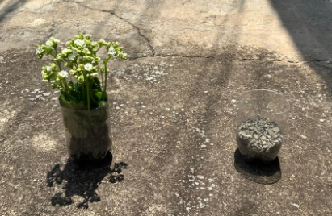

# Projeto 3 - Efeito Estufa e Aquecimento Global - IE323A - Tópicos em Eletrônica

## Autor

Victor Anthony Teixeira dos Santos - 206467

## Introdução
Este projeto, se trata de um experimento em que podemos demonstrar o efeito estufa e o aquecimento global, de forma que possamos elucidar esse problema de uma maneira clara para os alunos.

## Objetivos
A ideia é que os professores possam usar a BitDogLab para complementar o que foi passado em aula, de forma que possa facilitar a melhor visualização do aluno sobre o conteúdo a ser estudado.

   Este projeto está alinhado com as seguintes habilidades específicas da BNCC:

**(EF07CI12)** Demonstrar que o ar é uma mistura de gases, identificando sua composição, e discutir fenômenos naturais ou antrópicos que podem alterar essa composição.

**(EF07CI13)** Descrever o mecanismo natural do efeito estufa, seu papel fundamental para o desenvolvimento da vida na Terra, discutir as ações humanas responsáveis pelo seu aumento artificial (queima dos combustíveis fósseis, desmatamento, queimadas etc.) e selecionar e implementar propostas para a reversão ou controle desse quadro.

## Materiais Utilizados:

**Recursos on-board**
- Display Oled
- Botão
- Matriz RGB
- Buzzer

**Recursos off-board**
- 2 x Sensores de Temperatura e Umidade BME680
- 16 x Cabos groove 20cm
- 2 x Conectores para cabo groove
- 1 x Sensor HC05
- 1 x PCB Adaptada para o sensor HC05

## Código

O software foi projetado para ter uma interação entre os sensores BME680 e o HC05, junto com o display OLED, a matriz RGB e o buzzer.
O display OLED mostrará a temperatura, umidade, gás e pressão em cada ambiente. Nessa parte tem uma interação com o botão, que ao pressionar o botão você alterna entre os sensores para ver as respectivas informações. Outra interação que vai ter é com a matriz RGB, de acordo com a temperatura a matriz RGB muda de cor e quando atingir uma temperatura acima de 30°C o buzzer aciona. Um adendo sobre a matriz RGB é que as duas primeiras colunas serão destinadas para o primeiro sensor e as duas últimas serão destinadas ao segundo sensor.
Essas informações são enviadas para o sensor bluetooth HC05, e posteriormente serão lidas por uma dashboard. Dessa forma, será possível ver as informações no celular também.

Abaixo temos dois fluxogramas do código e uma imagem para ilustrar melhor.

Fluxograma 1

Fluxograma 2

Exemplo BitDog funcionando

## PCB
Para esse projeto foi desenvolvida uma PCB, essa PCB foi utilizada para utilizar o sensor HC05, com isso, não foi preciso utilizar uma protoboard, nem deixar fio solto.
É uma PCB simples, utilizamos os pinos do conector IDC para utilizar o sensor HC05.

Listas de Materiais:

- 1 x Conector IDC Macho 2x7
- 1 x Conector Soquete Fêmea 1x4
- 1 x Led 3mm (Verde ou Vermelho)
- 1 x Resistor 150Ω
- 1 x x Cabo Flat 2x7
  
## Dashboard
A dashboard foi desenvolvida utilizando o AppInventor. O objetivo dela, é que os alunos possam ver os parâmetros dos sensores pelo celular também.

## Conexão com Bluetooth

Fazer download do AppInventor na PlayStore, após isso abrir o app, clicar em " scan QR code". Depois, é só scanear o QR Code abaixo e o app irá carregar no seu celular.

Caso o QR Code não estaja funcionando, iremos disponibilizar o arquivo .aia, dessa forma, você conseguirá não somente acessar o aplicativo, como também fazer modificações nele.

Assim que abrir o aplicativo, basta clicar em conectar, e selecionar o sensor HC05, após isso, o app começara a mostrar os parâmetros do sensor.

## Experimento

Tem como objetivo fazer uma comparação entre temperaturas em dois ambientes diferentes.

Basicamente, o experimento vai precisar de 4 garrafas pet 's, terra, planta e brita, além dos sensores de BME680 e HC05.

1 - Montar o experimento

2 - Fazer um medida antes de levar o ambiente para o sol

3 - Levar os ambientes para o sol (Recomendação: 30 minutos)

4 - Realizar outra medição após tirar o ambiente do sol

## Uso da BitDogLab

A BitDogLab possui um repositório próprio que pode ser encontrado no link:https://github.com/BitDogLab/BitDogLab/tree/main

Para uma primeira experiência com a BitDogLab

1. Energizar a placa da BitDog - Plugue o cabo USB no computador ou utilize uma bateria adequada.
2. Aguarde enquanto a BitDog realiza o seu proceso de inicialização automático.
3. Abrir a IDE Thonny e carregar os códigos que estão no repositório
 
**Observações importantes**

Caso for replicar o experimento, não esquecer de:
- Carregar a biblioteca BME680 no microcontrolador.
- Ficar atento quando for utilizar os pinos da comunicação I2C.
- Ficar atento ao ligar os pinos do I2C com os pinos do sensor BME680.
- Ficar atento para conectar corretamente os sensores, lembrando que o I2C1 fica na esquerda da BitDogLab e o I20 fica na direita.
- Em relação ao sensor HC05, não esquecer que ele é alimentado com 5V e a ligação dele é TX - RX e RX- TX.

Para mais informações consultar o documento no docs, lá tem uma explicação detalhada do código e do experimento.

