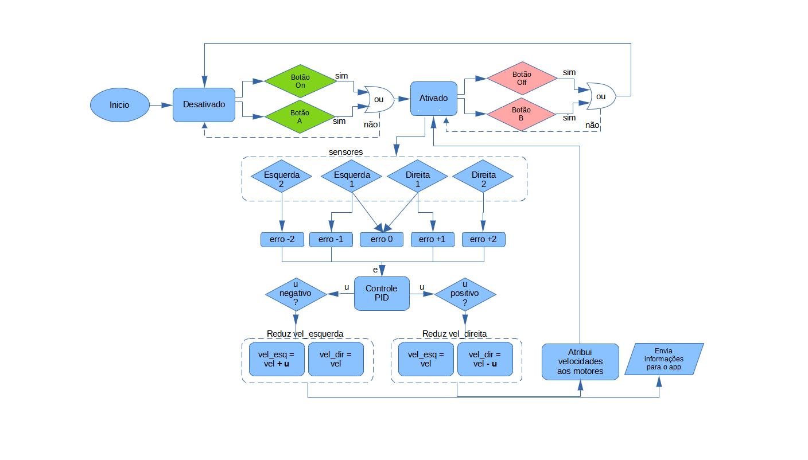
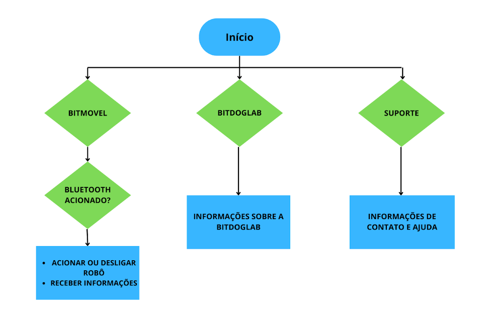

# Autores

Vinicius Emanoel Ares, RA: 083028  
Edson Costa Oliveira, RA: 188405 

# BitMóvel Seguidor de Linha, versao com monitoramento de bateria

O fluxograma abaixo ilustra o funcionamento do programa embarcado no microcontrolador da BitDogLab:

O fluxograma abaixo ilustra o funcionamento do aplicativo de celular:

